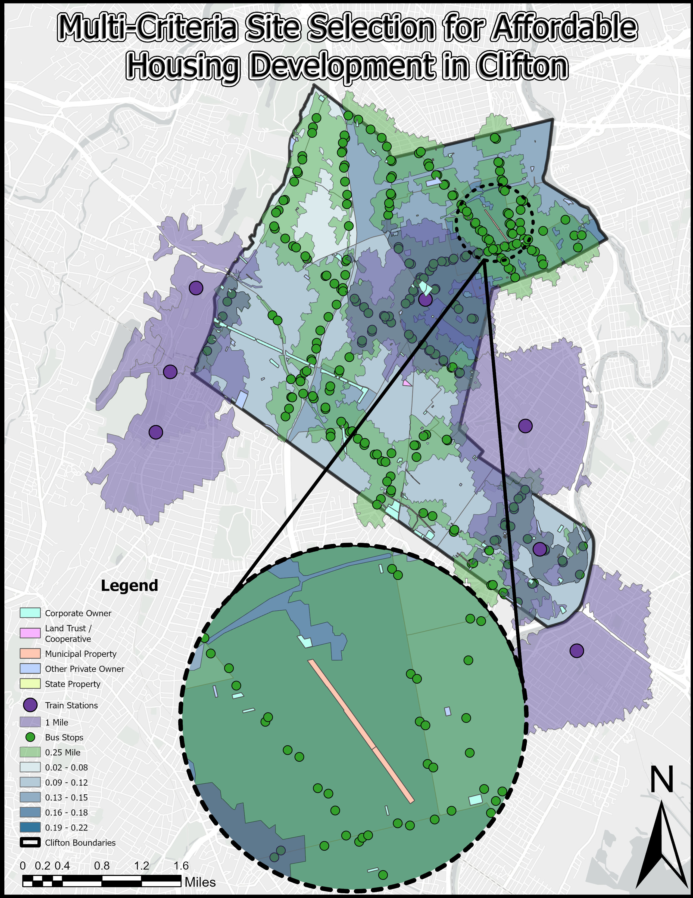

<!DOCTYPE html>
<html lang="en">
<head>
    <meta charset="UTF-8">
    <meta name="viewport" content="width=device-width, initial-scale=1.0">
    <title>Affordable Housing Development Feasibility Analysis - Clifton, NJ</title>
    
</head>
<body>
    <header>
        <h1>Affordable Housing Development Feasibility Analysis</h1>
        <h2>Clifton, New Jersey</h2>
    </header>
    
    <main>
        <section id="introduction">
            <h2>Introduction</h2>
            
This project analyzes the potential for affordable housing development in Clifton, New Jersey through GIS-based spatial analysis. Using demographic, economic, and land use data, this study identifies priority areas for affordable housing development based on socioeconomic need, transit accessibility, and vacant land availability.

        </section>

        <section id="key-findings">
            <h2>Key Findings</h2>
            
            

                <h3>Land Use Distribution and Tax Revenue</h3>
                
The analysis of Clifton's land use reveals that residential properties dominate the landscape, covering 52.57% of the city's total land area, while generating approximately $222 million in annual tax revenue.

                
                
                <table>
                    <thead>
                        <tr>
                            <th>Property Class</th>
                            <th>Class Type</th>
                            <th>Land Area (Acres)</th>
                            <th>Percentage of Total</th>
                            <th>Last Year Tax</th>
                            <th>Avg Tax per SqFt</th>
                        </tr>
                    </thead>
                    <tbody>
                        <tr>
                            <td>1</td>
                            <td>Vacant Land</td>
                            <td>139.3</td>
                            <td>2.66%</td>
                            <td>$2,147,974.02</td>
                            <td>$0.35</td>
                        </tr>
                        <tr>
                            <td>15A</td>
                            <td>Public School Property</td>
                            <td>129.3</td>
                            <td>2.47%</td>
                            <td>$0</td>
                            <td>$0.00</td>
                        </tr>
                        <tr>
                            <td>15B</td>
                            <td>Other School Property</td>
                            <td>22.3</td>
                            <td>0.43%</td>
                            <td>$8,661.17</td>
                            <td>$0.01</td>
                        </tr>
                        <tr>
                            <td>15C</td>
                            <td>Public Property</td>
                            <td>315.3</td>
                            <td>6.01%</td>
                            <td>$19,467.84</td>
                            <td>$0.00</td>
                        </tr>
                        <tr>
                            <td>15D</td>
                            <td>Religious & Charitable Property</td>
                            <td>95.8</td>
                            <td>1.83%</td>
                            <td>$13,471.05</td>
                            <td>$0.00</td>
                        </tr>
                        <tr>
                            <td>15E</td>
                            <td>Cemeteries and Graveyards</td>
                            <td>189.9</td>
                            <td>3.62%</td>
                            <td>$0</td>
                            <td>$0.00</td>
                        </tr>
                        <tr>
                            <td>15F</td>
                            <td>Other Exempt properties</td>
                            <td>36.3</td>
                            <td>0.69%</td>
                            <td>$188,779.06</td>
                            <td>$0.12</td>
                        </tr>
                        <tr>
                            <td>2</td>
                            <td>Residential</td>
                            <td>2,755.9</td>
                            <td>52.57%</td>
                            <td>$222,104,426.30</td>
                            <td>$1.85</td>
                        </tr>
                        <tr>
                            <td>3A</td>
                            <td>Farms</td>
                            <td>14.4</td>
                            <td>0.28%</td>
                            <td>$17,295.09</td>
                            <td>$0.03</td>
                        </tr>
                        <tr>
                            <td>4A</td>
                            <td>Commercial</td>
                            <td>651.9</td>
                            <td>12.43%</td>
                            <td>$45,114,041.48</td>
                            <td>$1.59</td>
                        </tr>
                        <tr>
                            <td>4B</td>
                            <td>Industrial</td>
                            <td>668.0</td>
                            <td>12.74%</td>
                            <td>$31,322,155.54</td>
                            <td>$1.08</td>
                        </tr>
                        <tr>
                            <td>4C</td>
                            <td>Apartments</td>
                            <td>131.9</td>
                            <td>2.52%</td>
                            <td>$8,205,775.71</td>
                            <td>$1.43</td>
                        </tr>
                        <tr>
                            <td>5A</td>
                            <td>Class I Railroad Property</td>
                            <td>85.7</td>
                            <td>1.63%</td>
                            <td>$0</td>
                            <td>$0.00</td>
                        </tr>
                        <tr>
                            <td>5B</td>
                            <td>Class II Railroad Property</td>
                            <td>6.7</td>
                            <td>0.13%</td>
                            <td>$0</td>
                            <td>$0.00</td>
                        </tr>
                        <tr>
                            <td><strong>Total</strong></td>
                            <td></td>
                            <td><strong>5,242.7</strong></td>
                            <td><strong>100.0%</strong></td>
                            <td><strong>$309,142,047</strong></td>
                            <td></td>
                        </tr>
                    </tbody>
                </table>

                

                    <h4>Potential Additional Tax Revenue from Vacant Land Development:</h4>
                    <ul>
                        <li>If developed as Residential: $11,227,129.22</li>
                        <li>If developed as Commercial: $45,114,030.53</li>
                        <li>If developed as Industrial: $31,322,147.39</li>
                        <li>If developed as Apartments: $8,205,776.84</li>
                    </ul>
                

            

            
            

                <h3>Housing Occupancy Patterns</h3>
                
Clifton exhibits distinct patterns of housing occupancy, with owner-occupied units (shown in teal) dominating the western portions of the city, while renter-occupied units (shown in peach) are concentrated in the eastern and central areas.

                
            

            

                <h3>Income Distribution</h3>
                
The analysis reveals significant income disparities across Clifton, with median household incomes ranging from over $119,300 in the western neighborhoods to less than $37,800 in the northeastern section.

                
            

            

                <h3>Housing Cost Burden</h3>
                
A substantial proportion of Clifton's renters experience housing cost burden, with several census tracts showing that over 66% of renter households spend 30% or more of their income on housing costs.

                
            

        </section>

        <section id="vacant-land-analysis">
            <h2>Vacant Land Analysis</h2>

            

                <h3>Spatial Distribution of Vacant Parcels</h3>
                
Vacant parcels in Clifton are not randomly distributed but show distinct clustering patterns along major transportation corridors and in areas with lower land values. The choropleth map below shows the land value per square foot across Clifton, with vacant parcels highlighted in magenta.

                
            

            

                <h3>Transit Accessibility</h3>
                
The analysis of transit accessibility reveals that many vacant parcels are well-served by public transportation, with numerous bus stops throughout the city and several train stations in neighboring communities.

                
            

        </section>

        <section id="need-score">
            <h2>Affordable Housing Development Opportunities</h2>

            

                <h3>Need Score Methodology</h3>
                
To identify priority areas for affordable housing development, a composite "Need Score" was created by normalizing and combining four key indicators:

                
                <ol>
                    <li><strong>Rent Burden</strong>: Percentage of renter households spending 30% or more of income on rent</li>
                    <li><strong>Owner Burden</strong>: Percentage of owner households spending 30% or more on housing costs</li>
                    <li><strong>Low-Income Population</strong>: Percentage of households with annual income below $75,000</li>
                    <li><strong>Demographic Composition</strong>: Percentage of people of color</li>
                </ol>
                
                
Each indicator was normalized using min-max scaling to create a 0-1 scale:

                <pre>Normalized_Value = (Raw_Value - Minimum_Value) / (Maximum_Value - Minimum_Value)</pre>
                
                
The Need Score was calculated as the average of the four normalized indicators:

                <pre>Need_Score = (Norm_RentBurden + Norm_OwnerBurden + Norm_LowIncome + Norm_POC) / 4</pre>
            

            

                <h3>Priority Areas for Development</h3>
                
The combined analysis of Need Score and vacant parcel distribution identifies several high-priority areas for affordable housing development, particularly in the eastern and central portions of Clifton.

                
            

            

                <h3>Transit-Oriented Development Opportunities</h3>
                
By overlaying transit accessibility with vacant parcels and Need Score, the analysis identifies specific opportunities for transit-oriented affordable housing development.

                
            

        </section>

        <section id="racial-composition">
            <h2>Racial and Ethnic Composition</h2>
            
The demographic analysis shows that Clifton has distinct patterns of racial and ethnic distribution, with Hispanic or Latino populations concentrated in the eastern portions of the city.

            
        </section>

        <section id="conclusions">
            <h2>Conclusions and Recommendations</h2>
            
            
Based on the comprehensive analysis, the following recommendations are proposed for affordable housing development in Clifton:

            
            

                <strong>Prioritize Eastern Census Tracts</strong>: Focus affordable housing development in eastern Clifton where Need Scores are highest and multiple vacant parcels are available.
            

            
            

                <strong>Leverage Transit-Oriented Development</strong>: Target vacant parcels within 0.25 miles of bus stops or 0.5 miles of train stations to maximize accessibility for lower-income residents without vehicles.
            

            
            

                <strong>Diversify Housing Stock</strong>: Develop a mix of housing types, including apartments and multi-family residential buildings, particularly in areas currently dominated by single-family homes.
            

            
            

                <strong>Public-Private Partnerships</strong>: Establish partnerships with private developers to maximize the development potential of vacant land, particularly where corporate ownership is present.
            

            
            

                <strong>Tax Revenue Optimization</strong>: Consider mixed-use developments that include commercial components to optimize tax revenue generation while still providing affordable housing units.
            

            
            

                <strong>Inclusionary Zoning</strong>: Implement inclusionary zoning policies requiring a percentage of affordable units in new residential developments, particularly in areas with high median incomes.
            

        </section>

        <section id="limitations">
            <h2>Limitations and Further Research</h2>
            
            
This analysis has several limitations that could be addressed in future research:

            
            <ul>
                <li><strong>Data Currency</strong>: Some demographic data may not capture recent changes in population or housing patterns.</li>
                <li><strong>Zoning Constraints</strong>: This analysis does not incorporate current zoning regulations that may limit development potential.</li>
                <li><strong>Environmental Factors</strong>: Potential environmental constraints on vacant parcels are not considered.</li>
                <li><strong>Market Dynamics</strong>: Current market conditions and developer interest are not fully captured.</li>
            </ul>
            
            
Additional data sources that would enhance the analysis include:

            
            <ul>
                <li>Detailed zoning and land use regulations</li>
                <li>Utility infrastructure capacity</li>
                <li>Brownfield or contamination site data</li>
                <li>Housing permits and pipeline projects</li>
                <li>School enrollment and capacity data</li>
                <li>Detailed parcel-level ownership information</li>
            </ul>
        </section>
    </main>
    
    <footer>
        
Created by Your Name | Topics in GIS Course | May 2025

    </footer>
</body>
</html>
