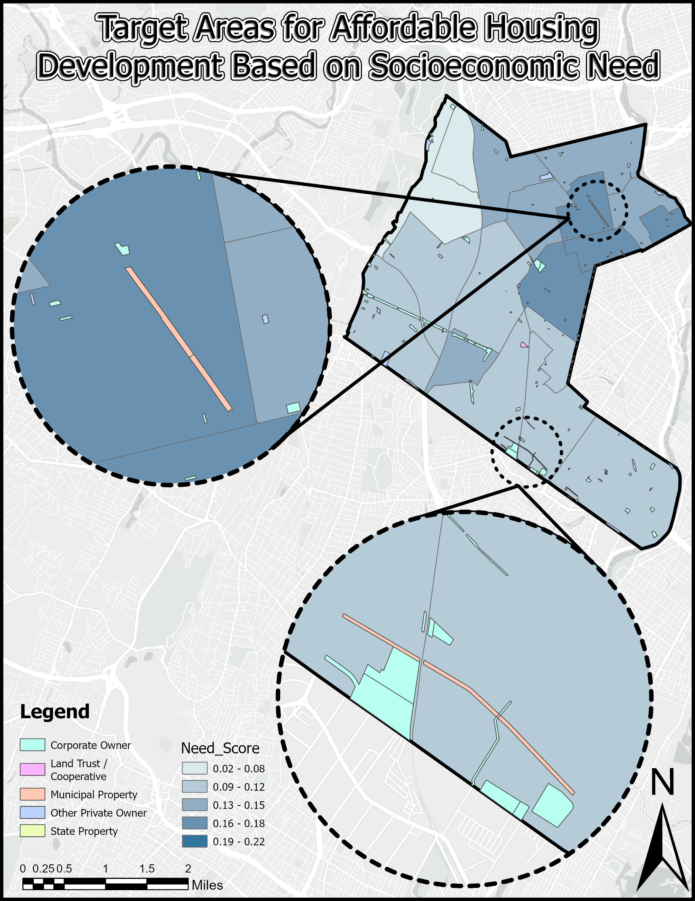

<!DOCTYPE html>
<html lang="en">
<head>
    <meta charset="UTF-8">
    <meta name="viewport" content="width=device-width, initial-scale=1.0">
    <title>Comprehensive Affordable Housing Development Feasibility Analysis - Clifton, NJ</title>
    
    
</head>
<body>
    <header>
        <h1>Affordable Housing Development Feasibility Analysis</h1>
        <h2>Clifton, New Jersey</h2>
    </header>
    
    <main>
        <section id="introduction">
            <h2>Introduction</h2>
            
This project analyzes the potential for affordable housing development in Clifton, New Jersey through GIS-based spatial analysis. Using demographic, economic, and land use data, this study identifies priority areas for affordable housing development based on socioeconomic need, transit accessibility, and vacant land availability.

            
            

                <h3>Study Area: Clifton, New Jersey</h3>
                
            

        </section>

        <section id="key-findings">
            <h2>Key Findings</h2>
            
            

                <h3>Land Use Distribution and Tax Revenue</h3>
                
The analysis of Clifton's land use reveals that residential properties dominate the landscape, covering 52.57% of the city's total land area, while generating approximately $222 million in annual tax revenue.

                
                
                <table>
                    <thead>
                        <tr>
                            <th>Property Class</th>
                            <th>Property Type</th>
                            <th>Land Area (Acres)</th>
                            <th>Percentage of Total</th>
                            <th>Annual Tax Revenue</th>
                            <th>Avg Tax per Sq. Ft.</th>
                        </tr>
                    </thead>
                    <tbody>
                        <tr>
                            <td>1</td>
                            <td>Vacant Land</td>
                            <td>139.3</td>
                            <td>2.66%</td>
                            <td>$2,147,974.02</td>
                            <td>$0.35</td>
                        </tr>
                        <tr>
                            <td>15A</td>
                            <td>Public School Property</td>
                            <td>129.3</td>
                            <td>2.47%</td>
                            <td>$0</td>
                            <td>$0.00</td>
                        </tr>
                        <tr>
                            <td>15B</td>
                            <td>Other School Property</td>
                            <td>22.3</td>
                            <td>0.43%</td>
                            <td>$8,661.17</td>
                            <td>$0.01</td>
                        </tr>
                        <tr>
                            <td>15C</td>
                            <td>Public Property</td>
                            <td>315.3</td>
                            <td>6.01%</td>
                            <td>$19,467.84</td>
                            <td>$0.00</td>
                        </tr>
                        <tr>
                            <td>15D</td>
                            <td>Religious & Charitable Property</td>
                            <td>95.8</td>
                            <td>1.83%</td>
                            <td>$13,471.05</td>
                            <td>$0.00</td>
                        </tr>
                        <tr>
                            <td>15E</td>
                            <td>Cemeteries and Graveyards</td>
                            <td>189.9</td>
                            <td>3.62%</td>
                            <td>$0</td>
                            <td>$0.00</td>
                        </tr>
                        <tr>
                            <td>15F</td>
                            <td>Other Exempt properties</td>
                            <td>36.3</td>
                            <td>0.69%</td>
                            <td>$188,779.06</td>
                            <td>$0.12</td>
                        </tr>
                        <tr>
                            <td>2</td>
                            <td>Residential</td>
                            <td>2,755.9</td>
                            <td>52.57%</td>
                            <td>$222,104,426.30</td>
                            <td>$1.85</td>
                        </tr>
                        <tr>
                            <td>3A</td>
                            <td>Farms</td>
                            <td>14.4</td>
                            <td>0.28%</td>
                            <td>$17,295.09</td>
                            <td>$0.03</td>
                        </tr>
                        <tr>
                            <td>4A</td>
                            <td>Commercial</td>
                            <td>651.9</td>
                            <td>12.43%</td>
                            <td>$45,114,041.48</td>
                            <td>$1.59</td>
                        </tr>
                        <tr>
                            <td>4B</td>
                            <td>Industrial</td>
                            <td>668.0</td>
                            <td>12.74%</td>
                            <td>$31,322,155.54</td>
                            <td>$1.08</td>
                        </tr>
                        <tr>
                            <td>4C</td>
                            <td>Apartments</td>
                            <td>131.9</td>
                            <td>2.52%</td>
                            <td>$8,205,775.71</td>
                            <td>$1.43</td>
                        </tr>
                        <tr>
                            <td>5A</td>
                            <td>Class I Railroad Property</td>
                            <td>85.7</td>
                            <td>1.63%</td>
                            <td>$0</td>
                            <td>$0.00</td>
                        </tr>
                        <tr>
                            <td>5B</td>
                            <td>Class II Railroad Property</td>
                            <td>6.7</td>
                            <td>0.13%</td>
                            <td>$0</td>
                            <td>$0.00</td>
                        </tr>
                        <tr>
                            <td><strong>Total</strong></td>
                            <td></td>
                            <td><strong>5,242.7</strong></td>
                            <td><strong>100.0%</strong></td>
                            <td><strong>$309,142,047</strong></td>
                            <td></td>
                        </tr>
                    </tbody>
                </table>

                

                    <h4>Potential Additional Tax Revenue from Vacant Land Development:</h4>
                    <ul>
                        <li>If developed as Residential: $11,227,129.22</li>
                        <li>If developed as Commercial: $45,114,030.53</li>
                        <li>If developed as Industrial: $31,322,147.39</li>
                        <li>If developed as Apartments: $8,205,776.84</li>
                    </ul>
                

            

            
            

                <h3>Socioeconomic and Housing Analysis</h3>
                
The following maps provide a comprehensive view of Clifton's socioeconomic patterns and housing characteristics, revealing important spatial relationships that inform affordable housing needs.

                
                
                
                

                    

                        
                        
Racial and Ethnic Composition

                    

                    

                        
                        
Rent Burden Distribution

                    

                    

                        
                        
Income Distribution

                    

                    

                        
                        
Housing Occupancy Patterns

                    

                    

                        
                        
Median Household Income

                    

                

                
                
The maps reveal several key patterns:

                <ul>
                    <li><strong>Housing Occupancy Patterns:</strong> Owner-occupied units (shown in teal) dominate the western portions of the city, while renter-occupied units (shown in peach) are concentrated in the eastern and central areas.</li>
                    <li><strong>Income Distribution:</strong> Significant income disparities exist across Clifton, with median household incomes ranging from over $119,300 in the western neighborhoods to less than $37,800 in the northeastern section.</li>
                    <li><strong>Housing Cost Burden:</strong> A substantial proportion of Clifton's renters experience housing cost burden, with several census tracts showing that over 66% of renter households spend 30% or more of their income on housing costs.</li>
                    <li><strong>Racial and Ethnic Patterns:</strong> Clifton's eastern neighborhoods show higher concentrations of Hispanic or Latino populations, correlating with areas of higher housing cost burden.</li>
                </ul>
            

        </section>

        <section id="vacant-land-analysis">
            <h2>Vacant Land Analysis</h2>

            

                <h3>Spatial Distribution of Vacant Parcels</h3>
                
Vacant parcels in Clifton are not randomly distributed but show distinct clustering patterns along major transportation corridors and in areas with lower land values. The choropleth map below shows the land value per square foot across Clifton, with vacant parcels highlighted in magenta.

                
            

            

                <h3>Transit Accessibility</h3>
                
The analysis of transit accessibility was conducted using ESRI's Network Analyst tool to evaluate pedestrian connectivity to public transportation. Service areas were calculated to precisely delineate zones within a 0.25-mile walking distance of bus stops and a 1.0-mile walking distance of train stations, accounting for the actual street network rather than simple Euclidean distance. This methodology provides a more accurate representation of transit accessibility that reflects real-world pedestrian movement patterns.

                
                
                <h3>Spatial Clustering of Public Transit</h3>
                
To further understand the spatial distribution of public transit in Clifton, Optimized Hot Spot Analysis was performed. This geostatistical method identifies statistically significant spatial clusters of high values (hot spots) and low values (cold spots) using the Getis-Ord Gi* statistic. The analysis reveals three distinct hot spot clusters of transit service concentration within Clifton, with the most intense clustering (99% confidence) appearing in the northeastern section of the city. These high-confidence hot spots represent areas where transit accessibility is significantly higher than would be expected by random chance, indicating strategic opportunities for transit-oriented affordable housing development.

                
                
                
The hot spot analysis reinforces the transit accessibility findings by quantitatively identifying areas where multiple transit routes converge, creating nodes of exceptional connectivity. The northeastern cluster, in particular, corresponds with areas of higher housing need scores, creating an ideal intersection of transit access and affordable housing demand. These statistically significant clusters should be prioritized when considering locations for transit-oriented affordable housing development.

            

        </section>

        <section id="need-score">
            <h2>Affordable Housing Development Opportunities</h2>

            

                <h3>Need Score Methodology</h3>
                
To identify priority areas for affordable housing development, a composite "Need Score" was created by normalizing and combining four key indicators:

                
                <ol>
                    <li><strong>Rent Burden</strong>: Percentage of renter households spending 30% or more of income on rent</li>
                    <li><strong>Owner Burden</strong>: Percentage of owner households spending 30% or more on housing costs</li>
                    <li><strong>Low-Income Population</strong>: Percentage of households with annual income below $75,000</li>
                    <li><strong>Demographic Composition</strong>: Percentage of people of color</li>
                </ol>
                
                
Each indicator was normalized using min-max scaling to create a 0-1 scale:

                <pre>Normalized_Value = (Raw_Value - Minimum_Value) / (Maximum_Value - Minimum_Value)</pre>
                
                
The Need Score was calculated as the average of the four normalized indicators:

                <pre>Need_Score = (Norm_RentBurden + Norm_OwnerBurden + Norm_LowIncome + Norm_POC) / 4</pre>
            

            

                <h3>Priority Areas for Development</h3>
                
The combined analysis of Need Score and vacant parcel distribution identifies several high-priority areas for affordable housing development, particularly in the eastern and central portions of Clifton. In our site selection methodology, we prioritized municipally-owned vacant parcels to streamline development by avoiding potential condemnation proceedings and associated legal complexities. The analysis identified only two municipal vacant parcels within the study area.

                
                
            

            

                <h3>Where to Build Next? Multi-Criteria Evaluation of Housing Development</h3>
                
By overlaying transit accessibility with municipal vacant parcels and Need Score, the analysis identifies specific opportunities for transit-oriented affordable housing development. The parcel located in the north-central region emerging as the optimal development site, based on multiple criteria:

    
                <ul>
                    <li>Strategic location within a census tract exhibiting high affordable housing need scores</li>
                    <li>Exceptional transit connectivity with proximity to multiple bus stops, enhancing accessibility for transit-dependent residents</li>
                    <li>Potential for integration with existing community infrastructure and services</li>
                </ul>
                
                
            

        </section>

<section id="vacant-site-analysis">
    <h2>Historical Analysis of Clifton Railroad Corporation Site (1995-2024)</h2>
    
    

        <h3>Introduction</h3>
        
This analysis examines the historical transformation of the Clifton Railroad Corporation site in Clifton, New Jersey, through a chronological study of satellite imagery spanning nearly three decades. The site, encompassing 3.076 acres of land, represents a significant opportunity for affordable housing development due to its location, moderate size, and evolving usage patterns over time.

    

    

        <h3>Past: Active Industrial Operations (1995)</h3>
        
        
The 1995 black and white satellite image reveals an actively functioning industrial site characteristic of mid-to-late 20th century rail operations in northern New Jersey. Key features visible in this earliest image include:

        
        <ul>
            <li>Multiple large warehouse structures with distinctive long, rectangular footprints</li>
            <li>Extensive paved areas used for vehicle and material storage</li>
            <li>Clear signs of industrial activity throughout the property</li>
            <li>A well-defined operational footprint extending across the full parcel</li>
            <li>Adjacent residential neighborhoods with clear boundaries from the industrial zone</li>
        </ul>
        
        
During this period, Clifton's industrial corridor, which includes this site, played an important role in the regional economy. The railroad infrastructure facilitated the movement of goods and materials, supporting manufacturing and distribution activities throughout Passaic County.

    

    
    

        <h3>Transition Period: Early Signs of Change (2010)</h3>
        
        
By 2010, the color satellite imagery shows notable changes to the site, marking the beginning of a transition in its usage patterns:

        
        <ul>
            <li>Warehouse structures remain intact, maintaining their original configuration</li>
            <li>More clearly defined storage areas and vehicle parking zones</li>
            <li>Some sections show reduced activity compared to the 1995 image</li>
            <li>Surrounding residential areas remain stable with little apparent change</li>
            <li>Increased vegetation visible along the site periphery</li>
        </ul>
        
        
This transition period coincides with broader economic shifts affecting industrial properties throughout northern New Jersey. While the site maintained operational functionality, the imagery suggests a less intensive use of certain areas compared to the earlier period.

    

    
    

        <h3>Recent Past: Declining Industrial Activity (2020)</h3>
        
        
The 2020 satellite image demonstrates more pronounced changes to the site's usage:

        
        <ul>
            <li>Continued operation of the main warehouse structures</li>
            <li>Significantly fewer vehicles and containers visible on the property</li>
            <li>Larger portions of the site appear underutilized</li>
            <li>Some areas showing apparent disuse or reduced maintenance</li>
            <li>Greater vegetation encroachment in peripheral areas</li>
            <li>Unchanged residential context surrounding the site</li>
        </ul>
        
        
This period reflects the continued decline in traditional industrial activities that has affected many similar properties in the region. While the site maintains some operational aspects, the imagery indicates substantial portions no longer support intensive industrial use.

    

    
    

        <h3>Present Conditions: Underutilization and Opportunity (2024)</h3>
        
        
The most recent imagery from 2024 shows further evolution of the site:

        
        <ul>
            <li>Warehouse structures still present but with visible signs of reduced activity</li>
            <li>Substantially decreased vehicle and material storage</li>
            <li>Large sections appear vacant or minimally utilized</li>
            <li>Maintained access to transportation infrastructure</li>
            <li>Stable surrounding residential context</li>
            <li>Continued integration with the urban fabric of Clifton</li>
        </ul>
        
        
The current state of the property reflects both the challenges and opportunities facing former industrial sites in urban New Jersey. While active operations have diminished, the site retains valuable characteristics including its size, location, and existing infrastructure.

    

    
    

        <h3>Future Potential: Transit-Oriented Affordable Housing</h3>
        
Based on the observed transformation over nearly three decades, this site presents compelling opportunities for redevelopment, particularly for affordable housing. Key factors supporting this potential include:

        
        

            

                <h4>Strategic Location</h4>
                <ul>
                    <li>Positioned between established residential neighborhoods</li>
                    <li>Proximity to commercial corridors along major roadways</li>
                    <li>Access to transportation infrastructure</li>
                    <li>Integration with the existing urban fabric</li>
                </ul>
            

            
            

                <h4>Transit Accessibility</h4>
                <ul>
                    <li>Multiple NJ Transit bus routes serve the surrounding area</li>
                    <li>Connectivity to regional transportation networks</li>
                    <li>Potential for transit-oriented development</li>
                </ul>
            

            
            

                <h4>Development Potential</h4>
                <ul>
                    <li>Moderate site size of 3.076 acres - ideal for a compact, efficient housing development</li>
                    <li>Sufficient area to accommodate 90-150 affordable housing units (depending on density, design, and parking requirements)</li>
                    <li>Existing infrastructure including utilities and access points</li>
                    <li>Relatively flat topography suitable for construction</li>
                    <li>Potential for cohesive, single-phase development given the manageable site size</li>
                </ul>
            

            
            

                <h4>Community Integration</h4>
                <ul>
                    <li>Natural extension of surrounding residential zones</li>
                    <li>Opportunity to enhance neighborhood connectivity</li>
                    <li>Potential to add community amenities lacking in the area</li>
                </ul>
            

        

    

    
    

        <h3>Implementation Considerations</h3>
        
While the site offers significant potential, several important factors would need addressing in any redevelopment planning:

        
        

            

                <h4>1. Environmental Assessment</h4>
                <ul>
                    <li>Former industrial sites typically require environmental study</li>
                    <li>Potential remediation needs based on historical rail usage</li>
                    <li>Opportunity for brownfield redevelopment funding</li>
                </ul>
            

            
            

                <h4>2. Community Engagement</h4>
                <ul>
                    <li>Involvement of surrounding neighborhoods in planning process</li>
                    <li>Assessment of local housing needs and preferences</li>
                    <li>Integration with existing community character</li>
                </ul>
            

            
            

                <h4>3. Infrastructure Capacity</h4>
                <ul>
                    <li>Evaluation of utility systems to support residential conversion</li>
                    <li>Transportation impact analysis</li>
                    <li>Stormwater management assessment</li>
                </ul>
            

            
            

                <h4>4. Development Efficiency</h4>
                <ul>
                    <li>At 3.076 acres, the site is an optimal size for a single-phase affordable housing project</li>
                    <li>Small enough to be financially manageable for municipal or non-profit developers</li>
                    <li>Large enough to achieve economies of scale in construction</li>
                    <li>Suitable for comprehensive rather than phased development</li>
                    <li>Potential for quicker implementation timeline compared to larger properties</li>
                </ul>
            

        

    

    
    

        <h3>Conclusion</h3>
        

            
The Clifton Railroad Corporation site illustrates the evolution of industrial properties in northern New Jersey over recent decades. From active industrial operations in 1995 to the current underutilized state in 2024, the changes visible in satellite imagery reflect broader economic transitions affecting similar properties throughout the region.

            
The site now presents a significant opportunity for affordable housing development that could leverage existing infrastructure and transit accessibility while addressing community needs. At 3.076 acres, it offers an ideal scale for an efficient affordable housing project - large enough to make a meaningful impact on housing availability but small enough to be financially feasible for municipal or non-profit developers. Through thoughtful planning that respects both the site's industrial heritage and its urban context, this compact property could transform from an underutilized industrial remnant to a vibrant residential community serving Clifton's future.

        

    

</section>

<section id="financial-analysis">
        <h2>Financial Feasibility Analysis</h2>
        
        

            <h3>Development Overview</h3>
            
Based on the site analysis of the 3.076-acre Clifton Railroad Corporation property, this financial feasibility study models a 120-unit mixed-income affordable housing development. The project leverages Low-Income Housing Tax Credits (LIHTC) and multiple funding sources to create housing affordable to residents earning 30-60% of Area Median Income (AMI).

            
            <!-- Key Metrics Dashboard -->
            

                

                    
🏗️

                    <h4>Total Development Cost</h4>
                    $36.8M
                    $306,638 per unit • $329.72 per sq ft
                

                

                    
💰

                    <h4>Net Operating Income</h4>
                    $1.09M
                    63.3% of revenue • $760 per unit/month
                

                

                    
📊

                    <h4>Debt Coverage Ratio</h4>
                    1.57
                    Above 1.20 requirement • Strong coverage
                

                

                    
🌟

                    <h4>Economic Impact</h4>
                    $1.86M
                    Annual local impact • 195 permanent jobs
                

            

        

        <!-- Tabbed Financial Analysis -->
        

            <nav class="tab-nav">
                <button class="tab-button active" onclick="showTab('development-costs')">Development Costs</button>
                <button class="tab-button" onclick="showTab('funding-sources')">Funding Sources</button>
                <button class="tab-button" onclick="showTab('unit-mix')">Unit Mix</button>
                <button class="tab-button" onclick="showTab('operating-model')">Operating Model</button>
                <button class="tab-button" onclick="showTab('economic-impact')">Economic Impact</button>
                <button class="tab-button" onclick="showTab('risk-analysis')">Risk Analysis</button>
            </nav>
            
            

                <!-- Development Costs Tab -->
                

                    <h3>Development Cost Analysis</h3>
                    <table class="financial-table">
                        <thead>
                            <tr>
                                <th>Cost Category</th>
                                <th>Unit Cost/sq ft</th>
                                <th>Quantity</th>
                                <th>Total Cost</th>
                                <th>% of Total</th>
                            </tr>
                        </thead>
                        <tbody>
                            <tr>
                                <td><strong>Land Acquisition</strong></td>
                                <td>$15</td>
                                <td>133,990 sq ft</td>
                                <td class="currency">$2,009,850</td>
                                <td class="percentage">5.46%</td>
                            </tr>
                            <tr>
                                <td><strong>Site Preparation</strong></td>
                                <td>$25</td>
                                <td>133,990 sq ft</td>
                                <td class="currency">$3,349,750</td>
                                <td class="percentage">9.10%</td>
                            </tr>
                            <tr>
                                <td>1BR Units (42 × 750 sq ft)</td>
                                <td>$210</td>
                                <td>31,500 sq ft</td>
                                <td class="currency">$6,615,000</td>
                                <td class="percentage">17.98%</td>
                            </tr>
                            <tr>
                                <td>2BR Units (48 × 950 sq ft)</td>
                                <td>$200</td>
                                <td>45,600 sq ft</td>
                                <td class="currency">$9,120,000</td>
                                <td class="percentage">24.78%</td>
                            </tr>
                            <tr>
                                <td>3BR Units (30 × 1,150 sq ft)</td>
                                <td>$190</td>
                                <td>34,500 sq ft</td>
                                <td class="currency">$6,555,000</td>
                                <td class="percentage">17.81%</td>
                            </tr>
                            <tr class="subtotal-row">
                                <td><strong>Hard Costs Subtotal</strong></td>
                                <td></td>
                                <td>111,600 sq ft</td>
                                <td class="currency">$22,480,000</td>
                                <td class="percentage">61.09%</td>
                            </tr>
                            <tr>
                                <td>Architecture & Engineering</td>
                                <td>8% of hard costs</td>
                                <td></td>
                                <td class="currency">$1,798,400</td>
                                <td class="percentage">4.89%</td>
                            </tr>
                            <tr>
                                <td>Legal & Professional</td>
                                <td>2% of hard costs</td>
                                <td></td>
                                <td class="currency">$449,600</td>
                                <td class="percentage">1.22%</td>
                            </tr>
                            <tr>
                                <td>Developer Fee</td>
                                <td>15% of hard costs</td>
                                <td></td>
                                <td class="currency">$3,372,000</td>
                                <td class="percentage">9.16%</td>
                            </tr>
                            <tr>
                                <td>Other Soft Costs</td>
                                <td></td>
                                <td></td>
                                <td class="currency">$3,336,906</td>
                                <td class="percentage">9.07%</td>
                            </tr>
                            <tr class="total-row">
                                <td><strong>TOTAL DEVELOPMENT COST</strong></td>
                                <td></td>
                                <td>120 units</td>
                                <td class="currency">$36,796,506</td>
                                <td class="percentage">100.00%</td>
                            </tr>
                        </tbody>
                    </table>
                

                <!-- Funding Sources Tab -->
                

                    <h3>Capital Stack & Funding Sources</h3>
                    <table class="financial-table">
                        <thead>
                            <tr>
                                <th>Funding Source</th>
                                <th>Amount</th>
                                <th>% of Total</th>
                                <th>Terms</th>
                                <th>Notes</th>
                            </tr>
                        </thead>
                        <tbody>
                            <tr class="highlight-row">
                                <td><strong>Low-Income Housing Tax Credits (LIHTC)</strong></td>
                                <td class="currency">$16,560,000</td>
                                <td class="percentage">45.00%</td>
                                <td>9% credits syndicated to equity investors, 30-year compliance</td>
                                <td>Primary equity source</td>
                            </tr>
                            <tr>
                                <td>Construction-to-Permanent Loan</td>
                                <td class="currency">$9,200,000</td>
                                <td class="percentage">25.00%</td>
                                <td>6.5% interest, 30-year amortization</td>
                                <td>Bank financing (Subject to NOI and DSCR sizing)</td>
                            </tr>
                            <tr>
                                <td>New Jersey Housing Trust Fund</td>
                                <td class="currency">$3,680,000</td>
                                <td class="percentage">10.00%</td>
                                <td>0% interest, 30-year term</td>
                                <td>Gap financing</td>
                            </tr>
                            <tr>
                                <td>HOME Investment Partnerships</td>
                                <td class="currency">$2,940,000</td>
                                <td class="percentage">7.99%</td>
                                <td>0% interest, deferred payment</td>
                                <td>Federal subsidy</td>
                            </tr>
                            <tr>
                                <td>Deferred Developer Fee (DDF)</td>
                                <td class="currency">$2,946,506</td>
                                <td class="percentage">8.01%</td>
                                <td>Equity contribution</td>
                                <td>Repaid from project cash flow over time</td>
                            </tr>
                            <tr>
                                <td>Developer Equity</td>
                                <td class="currency">$1,470,000</td>
                                <td class="percentage">3.99%</td>
                                <td>Equity contribution</td>
                                <td>Developer investment</td>
                            </tr>
                            <tr class="total-row">
                                <td><strong>TOTAL FUNDING</strong></td>
                                <td class="currency"><strong>$36,796,506</strong></td>
                                <td class="percentage"><strong>100.00%</strong></td>
                                <td></td>
                                <td></td>
                            </tr>
                        </tbody>
                    </table>
                    
                    

                        <h4>Financing Strategy</h4>
                        
The capital stack leverages multiple public funding sources to minimize debt service and maintain long-term affordability. LIHTC equity provides nearly half of total funding, while soft loans from state and federal programs reduce interest burden.

                    

                

                <!-- Unit Mix Tab -->
                

                    <h3>Unit Mix & Affordability Structure</h3>
                    
                    

                        

                            <h4>Total Units</h4>
                            
120

                        

                        

                            <h4>Total Sq Ft</h4>
                            
111,600

                        

                        

                            <h4>Annual Rent Revenue</h4>
                            
$1.82M

                        

                        

                            <h4>Average Rent</h4>
                            
$1,264

                        

                    

                    
                    <table class="financial-table">
                        <thead>
                            <tr>
                                <th>Unit Type</th>
                                <th>Count</th>
                                <th>Sq Ft</th>
                                <th>AMI Level</th>
                                <th>Max Income</th>
                                <th>Max Rent</th>
                                <th>Annual Revenue</th>
                            </tr>
                        </thead>
                        <tbody>
                            <tr class="highlight-row">
                                <td><strong>1BR Units</strong></td>
                                <td><strong>42</strong></td>
                                <td>750</td>
                                <td></td>
                                <td></td>
                                <td></td>
                                <td class="currency"><strong>$546,552</strong></td>
                            </tr>
                            <tr>
                                <td style="padding-left: 20px;">30% AMI</td>
                                <td>14</td>
                                <td>750</td>
                                <td>30%</td>
                                <td>$28,800</td>
                                <td>$720</td>
                                <td class="currency">$120,960</td>
                            </tr>
                            <tr>
                                <td style="padding-left: 20px;">40% AMI</td>
                                <td>10</td>
                                <td>750</td>
                                <td>40%</td>
                                <td>$38,400</td>
                                <td>$1,028</td>
                                <td class="currency">$123,360</td>
                            </tr>
                            <tr>
                                <td style="padding-left: 20px;">50% AMI</td>
                                <td>10</td>
                                <td>750</td>
                                <td>50%</td>
                                <td>$48,000</td>
                                <td>$1,285</td>
                                <td class="currency">$154,200</td>
                            </tr>
                            <tr>
                                <td style="padding-left: 20px;">60% AMI</td>
                                <td>8</td>
                                <td>750</td>
                                <td>60%</td>
                                <td>$57,600</td>
                                <td>$1,542</td>
                                <td class="currency">$148,032</td>
                            </tr>
                            <tr class="highlight-row">
                                <td><strong>2BR Units</strong></td>
                                <td><strong>48</strong></td>
                                <td>950</td>
                                <td></td>
                                <td></td>
                                <td></td>
                                <td class="currency"><strong>$742,872</strong></td>
                            </tr>
                            <tr>
                                <td style="padding-left: 20px;">30% AMI</td>
                                <td>16</td>
                                <td>950</td>
                                <td>30%</td>
                                <td>$32,910</td>
                                <td>$823</td>
                                <td class="currency">$158,016</td>
                            </tr>
                            <tr>
                                <td style="padding-left: 20px;">40% AMI</td>
                                <td>12</td>
                                <td>950</td>
                                <td>40%</td>
                                <td>$43,880</td>
                                <td>$1,234</td>
                                <td class="currency">$177,696</td>
                            </tr>
                            <tr>
                                <td style="padding-left: 20px;">50% AMI</td>
                                <td>10</td>
                                <td>950</td>
                                <td>50%</td>
                                <td>$54,850</td>
                                <td>$1,542</td>
                                <td class="currency">$185,040</td>
                            </tr>
                            <tr>
                                <td style="padding-left: 20px;">60% AMI</td>
                                <td>10</td>
                                <td>950</td>
                                <td>60%</td>
                                <td>$65,820</td>
                                <td>$1,851</td>
                                <td class="currency">$222,120</td>
                            </tr>
                            <tr class="highlight-row">
                                <td><strong>3BR Units</strong></td>
                                <td><strong>30</strong></td>
                                <td>1,150</td>
                                <td></td>
                                <td></td>
                                <td></td>
                                <td class="currency"><strong>$530,328</strong></td>
                            </tr>
                            <tr>
                                <td style="padding-left: 20px;">30% AMI</td>
                                <td>10</td>
                                <td>1,150</td>
                                <td>30%</td>
                                <td>$37,020</td>
                                <td>$926</td>
                                <td class="currency">$111,120</td>
                            </tr>
                            <tr>
                                <td style="padding-left: 20px;">40% AMI</td>
                                <td>8</td>
                                <td>1,150</td>
                                <td>40%</td>
                                <td>$49,360</td>
                                <td>$1,426</td>
                                <td class="currency">$136,896</td>
                            </tr>
                            <tr>
                                <td style="padding-left: 20px;">50% AMI</td>
                                <td>6</td>
                                <td>1,150</td>
                                <td>50%</td>
                                <td>$61,700</td>
                                <td>$1,782</td>
                                <td class="currency">$128,304</td>
                            </tr>
                            <tr>
                                <td style="padding-left: 20px;">60% AMI</td>
                                <td>6</td>
                                <td>1,150</td>
                                <td>60%</td>
                                <td>$74,040</td>
                                <td>$2,139</td>
                                <td class="currency">$154,008</td>
                            </tr>
                            <tr class="total-row">
                                <td><strong>TOTAL PROJECT</strong></td>
                                <td><strong>120</strong></td>
                                <td><strong>111,600</strong></td>
                                <td></td>
                                <td></td>
                                <td></td>
                                <td class="currency"><strong>$1,819,752</strong></td>
                            </tr>
                        </tbody>
                    </table>
                    
                    

                        <h4>Affordability Distribution</h4>
                        <ul>
                            <li><strong>30% AMI Units:</strong> 40 units (33.3%) - Extremely low income households</li>
                            <li><strong>40% AMI Units:</strong> 30 units (25.0%) - Very low income households</li>
                            <li><strong>50% AMI Units:</strong> 26 units (21.7%) - Low income households</li>
                            <li><strong>60% AMI Units:</strong> 24 units (20.0%) - Moderate income households</li>
                        </ul>
                        
<strong>100% of units</strong> serve households earning 60% or less of Area Median Income, ensuring deep affordability and LIHTC compliance.

                    

                

                <!-- Operating Model Tab -->
                

                    <h3>Year 1 Operating Financial Model</h3>
                    <table class="financial-table">
                        <thead>
                            <tr>
                                <th>Category</th>
                                <th>Annual Amount</th>
                                <th>Per Unit/Month</th>
                                <th>% of Revenue</th>
                            </tr>
                        </thead>
                        <tbody>
                            <tr class="highlight-row">
                                <td><strong>TOTAL RENTAL INCOME</strong></td>
                                <td class="currency">$1,819,752</td>
                                <td>$1,264</td>
                                <td class="percentage">100.00%</td>
                            </tr>
                            <tr>
                                <td>Less: Vacancy (5%)</td>
                                <td class="currency">($90,988)</td>
                                <td>($63)</td>
                                <td class="percentage">5.00%</td>
                            </tr>
                            <tr class="subtotal-row">
                                <td><strong>EFFECTIVE GROSS INCOME</strong></td>
                                <td class="currency">$1,728,764</td>
                                <td>$1,201</td>
                                <td class="percentage">95.00%</td>
                            </tr>
                            <tr>
                                <td>Property Management (6%)</td>
                                <td class="currency">$103,726</td>
                                <td>$72</td>
                                <td class="percentage">6.00%</td>
                            </tr>
                            <tr>
                                <td>Maintenance & Repairs</td>
                                <td class="currency">$172,876</td>
                                <td>$120</td>
                                <td class="percentage">10.00%</td>
                            </tr>
                            <tr>
                                <td>Property Taxes</td>
                                <td class="currency">$155,589</td>
                                <td>$108</td>
                                <td class="percentage">9.00%</td>
                            </tr>
                            <tr>
                                <td>Other Operating Expenses</td>
                                <td class="currency">$202,262</td>
                                <td>$140</td>
                                <td class="percentage">11.70%</td>
                            </tr>
                            <tr class="subtotal-row">
                                <td><strong>TOTAL OPERATING EXPENSES</strong></td>
                                <td class="currency">$634,457</td>
                                <td>$441</td>
                                <td class="percentage">36.70%</td>
                            </tr>
                            <tr class="highlight-row">
                                <td><strong>NET OPERATING INCOME</strong></td>
                                <td class="currency">$1,094,308</td>
                                <td>$760</td>
                                <td class="percentage">63.30%</td>
                            </tr>
                            <tr>
                                <td>Debt Service (Construction Loan)</td>
                                <td class="currency">$697,803</td>
                                <td>$485</td>
                                <td class="percentage">40.36%</td>
                            </tr>
                            <tr class="total-row">
                                <td><strong>NET CASH FLOW</strong></td>
                                <td class="currency">$396,505</td>
                                <td>$275</td>
                                <td class="percentage">22.94%</td>
                            </tr>
                        </tbody>
                    </table>
                    
                    

                        

                            <h4>Debt Coverage Ratio</h4>
                            
1.57

                        

                        

                            <h4>Cap Rate on Cost</h4>
                            
2.97%

                        

                        

                            <h4>NOI per Sq Ft</h4>
                            
$9.81

                        

                    

                

                <!-- Economic Impact Tab -->
                

                    <h3>Economic Impact Assessment</h3>
                    <table class="financial-table">
                        <thead>
                            <tr>
                                <th>Impact Category</th>
                                <th>Annual Value</th>
                                <th>One-Time Value</th>
                                <th>Description</th>
                            </tr>
                        </thead>
                        <tbody>
                            <tr>
                                <td>Property Tax Revenue</td>
                                <td class="currency">$114,280</td>
                                <td></td>
                                <td>6.28% PILOT rate under Long-Term Tax Exemption</td>
                            </tr>
                            <tr>
                                <td>Construction Jobs</td>
                                <td></td>
                                <td class="currency">$22,777,000</td>
                                <td>195 jobs × $32.09/hour × 2,080 hours × 1.75 years</td>
                            </tr>
                            <tr>
                                <td>Permanent Jobs</td>
                                <td class="currency">$195,000</td>
                                <td></td>
                                <td>Property management, maintenance (3 FTE)</td>
                            </tr>
                            <tr>
                                <td>Local Spending Multiplier</td>
                                <td class="currency">$1,555,200</td>
                                <td></td>
                                <td>120 households × $1,080/month spending</td>
                            </tr>
                            <tr>
                                <td>School Impact Fee</td>
                                <td></td>
                                <td class="currency">$180,000</td>
                                <td>$1,500 per unit school impact fee</td>
                            </tr>
                            <tr class="total-row">
                                <td><strong>TOTAL IMPACT</strong></td>
                                <td class="currency">$1,864,480</td>
                                <td class="currency">$22,957,000</td>
                                <td></td>
                            </tr>
                        </tbody>
                    </table>
                    
                    

                        <h4>Community Benefits</h4>
                        <ul>
                            <li><strong>$45,000 annual property tax savings</strong> through PILOT agreement vs. full taxation</li>
                            <li><strong>110 direct construction jobs</strong> and $11.5 million in construction wages</li>
                            <li><strong>Affordable housing for 120 families</strong> earning 30-60% of Area Median Income</li>
                        </ul>
                    

                

                <!-- Risk Analysis Tab -->
                

                    <h3>Risk Analysis and Sensitivity Testing</h3>
                    
                    <h4>Break-Even Analysis</h4>
                    <table class="financial-table">
                        <thead>
                            <tr>
                                <th>Metric</th>
                                <th>Break-Even Point</th>
                                <th>Current Performance</th>
                                <th>Safety Margin</th>
                            </tr>
                        </thead>
                        <tbody>
                            <tr>
                                <td>Occupancy Rate</td>
                                <td>73.21%</td>
                                <td>95%</td>
                                <td class="currency">21.79%</td>
                            </tr>
                            <tr>
                                <td>Average Rent</td>
                                <td>$974</td>
                                <td>$1,264</td>
                                <td class="currency">$290</td>
                            </tr>
                            <tr>
                                <td>Operating Expense Ratio</td>
                                <td>59.6%</td>
                                <td>36.70%</td>
                                <td class="currency">22.94%</td>
                            </tr>
                        </tbody>
                    </table>
                    
                    <h4>Scenario Analysis</h4>
                    <table class="financial-table">
                        <thead>
                            <tr>
                                <th>Scenario</th>
                                <th>Occupancy</th>
                                <th>Avg Rent</th>
                                <th>NOI</th>
                                <th>DSCR</th>
                            </tr>
                        </thead>
                        <tbody>
                            <tr class="highlight-row">
                                <td><strong>Base Case</strong></td>
                                <td>95.0%</td>
                                <td>$1,264</td>
                                <td class="currency">$1,094,308</td>
                                <td>1.57</td>
                            </tr>
                            <tr>
                                <td>Conservative</td>
                                <td>90.0%</td>
                                <td>$1,264</td>
                                <td class="currency">$1,003,364</td>
                                <td>1.44</td>
                            </tr>
                            <tr>
                                <td>Rent Stress</td>
                                <td>95.0%</td>
                                <td>$1,100</td>
                                <td class="currency">$858,508</td>
                                <td>1.23</td>
                            </tr>
                            <tr>
                                <td>Break-Even</td>
                                <td>73.2%</td>
                                <td>$1,264</td>
                                <td class="currency">$697,803</td>
                                <td>1.00</td>
                            </tr>
                        </tbody>
                    </table>
                

            

        

    </section>

    <!-- Add the required CSS and JavaScript -->
    

    

        <section id="limitations">
            <h2>Limitations and Further Research</h2>
            
            
This analysis has several limitations that could be addressed in future research:

            
            <ul>
                <li><strong>Data Currency</strong>: Some demographic data may not capture recent changes in population or housing patterns.</li>
                <li><strong>Zoning Constraints</strong>: This analysis does not incorporate current zoning regulations that may limit development potential.</li>
                <li><strong>Environmental Factors</strong>: Potential environmental constraints on vacant parcels are not considered.</li>
                <li><strong>Market Dynamics</strong>: Current market conditions and developer interest are not fully captured.</li>
            </ul>
            
            
Additional data sources that would enhance the analysis include:

            
            <ul>
                <li>Detailed zoning and land use regulations</li>
                <li>Utility infrastructure capacity</li>
                <li>Brownfield or contamination site data</li>
                <li>Housing permits and pipeline projects</li>
                <li>School enrollment and capacity data</li>
            </ul>
        </section>
    </main>
    
    <footer>
        
Created by Saba Akhavansadr | Topics in GIS | Spring 2025 | Professor Will Payne | Bloustein School of Planning and Public Policy, Rutgers University

    </footer>
</body>
</html>
